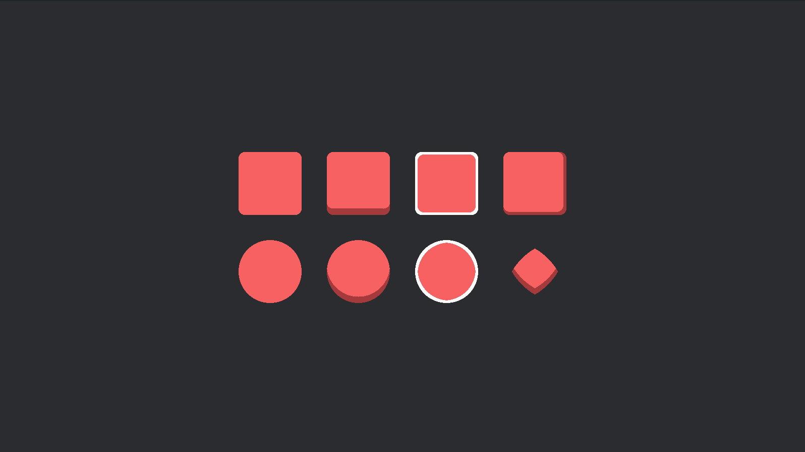

# Bevy Round UI

This [Bevy](https://bevyengine.org/) plugin contains a shader for rendering rounded rect UI elements, with an
adjustable offset that can be used to add borders or make the node appear 3D.

## Examples


The [simple](/examples/simple.rs) example shows how to use it in its simplest form. The
[buttons](/examples/buttons.rs) example shows how to use it with interactive buttons and a panel. The
[autosize](/examples/autosize.rs) example shows how to use it with flexibly-sized elements and the `autosize` feature.
The [circle](/examples/circle.rs) example shows how to make a circle shape. The [shapes](/examples/shapes.rs) example
shows a number of possible shapes.

## Basic Usage

1. Add the `RoundUiPlugin` to the app.
2. Create a `RoundUiMaterial` material.
3. Spawn a regular `MaterialNodeBundle` using the material.

> **IMPORTANT:** The `RoundUiMaterial` must have the same size as the node. For flexible layouts, see the
> [Auto Size](#auto-size) section below.

```rust
use bevy::prelude::*;
use bevy_round_ui::prelude::*;

fn main() {
    App::new()
        .add_plugins((DefaultPlugins, RoundUiPlugin))
        .add_systems(Startup, setup)
        .run();
}

fn setup(mut commands: Commands, mut materials: ResMut<Assets<RoundUiMaterial>>) {
    commands.spawn(Camera2dBundle::default());

    let panel_width = 200.0;
    let panel_height = 200.0;

    commands.spawn(MaterialNodeBundle {
        material: materials.add(RoundUiMaterial {
            background_color: Color::hex("#F76161").unwrap().into(),
            border_color: Color::hex("#A53A3D").unwrap().into(),
            border_radius: RoundUiBorder::all(20.0).into(),
            offset: RoundUiOffset::bottom(10.0).into(),
            size: Vec2::new(panel_width, panel_height),
        }),
        style: Style {
            width: Val::Px(panel_width),
            height: Val::Px(panel_height),
            ..default()
        },
        ..default()
    });
}
```

## Auto Size

The `autosize` Cargo feature (enabled by default) adds support for auto-sizing material nodes in various ways.


The following components are available to enable auto-sizing in various ways:

`RoundUiAutosizeMaterial`

Updates the material to match the size of the node. Use this in flexible layouts where nodes don't have a fixed size.

> **IMPORTANT:** This requires a unique material asset for each node. This means you can't re-use a
> `Handle<RoundUiMaterial>` among multiple nodes.

`RoundUiAutosizeNodePadding`

Update the node padding to match the border-radius and offset of the material. This is typically used when you have
text or other content inside a material node and don't want it pressed against the edges, or, like in the `buttons`
example, when the material might change, and you want the padding to automatically adjust.

`RoundUiAutosizeNode`

Update the size of the node to match the size of the material. Typically used then you are
re-using a `Handle<RoundUiMaterial>` and need all nodes to have the same size.

**Usage in Examples:**

- `buttons` - This example uses `RoundUiAutosizeNode` and `RoundUiAutosizeNodePadding` to make sure that all button
  nodes have the size and padding of their current material. All buttons use the same `Handle<RoundUiMaterial>` so
  this is important to prevent them from appearing "stretched". Notice how the padding changes automatically when
  clicking a button.
- `autosize` - This example uses `RoundUiAutosizeMaterial` and `RoundUiAutosizeNodePadding` to automatically update
  the material size when the node size changes.

## Shapes

The [shapes](/examples/shapes.rs) example demonstrates a number of possible shapes.

> NOTE: Bordered circles are not perfect.



## License

Dual-licensed under either of

- Apache License, Version 2.0, ([LICENSE-APACHE](/LICENSE-APACHE) or https://www.apache.org/licenses/LICENSE-2.0)
- MIT license ([LICENSE-MIT](/LICENSE-MIT) or https://opensource.org/licenses/MIT)

at your option.

## Contribution

Unless you explicitly state otherwise, any contribution intentionally submitted for inclusion in the work by you, as
defined in the Apache-2.0 license, shall be dual licensed as above, without any additional terms or conditions.
